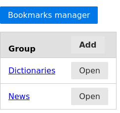
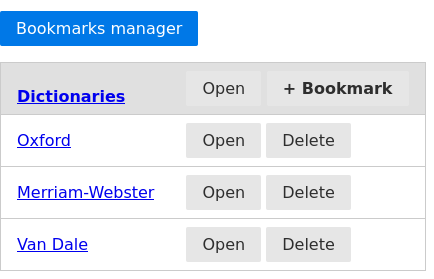

# Bookmarks Manager
A simple webapp to manage bookmarks and "read later" URLs.

On the main page you can manage (create, edit, delete) groups. Clicking the 'open' next to a group will open all bookmarks in tabs.



Opening a group gives you an overview of the bookmarks within the group and allows you to manage them (create, edit, delete).



# Getting started
You can use a docker image or just grab the code and run the python application.

In any case, this app is meant to be run behind a reverse proxy such as [Caddy](https://caddyserver.com/) (which I personally use) or [Nginx](https://www.nginx.com/).
The reverse proxy will serve two roles:
- Add HTTPS encryption to prevent plain-text communication
- Add basic_auth authentication for a single user per instance

The instructions are based on using Linux, but can be adjusted for Windows or macOS.

## Docker run
Pull the image.
```sh
docker pull ghcr.io/nimdaz/bookmarks-manager:main
```

Create and start a container. You can change the exposed port , for example: `-p 80:5000`
```sh
docker run -d -p 5000:5000 -v $PWD/data:/app/data --name bookmarks-manager bookmarks-manager
```

Check the IP adress of the docker container that you can access from the docker host/your machine. Probably it starts with 172.17.0.x.
```sh
docker logs bookmarks-manager
```
The webapp should be accessible on the IP and port as configured, for example: `http://172.17.0.2:5000`

## Docker compose
A docker compose file is a clear and concise way to configure and run you container.
```yaml
version: "3"
services:
  bookmarks-manager:
    image: ghcr.io/nimdaz/bookmarks-manager:main
    container_name: bookmarks-manager
    restart: unless-stopped
    ports:
      - '5000:5000'
    volumes:
      - '<PATH_ON_DOCKER_HOST>:/app/data'
```

## Python
Of course you can also run the python app directly without using docker. In most cases using a virtual environment is preferred.

```sh
git clone https://github.com/nimdaz/bookmarks-manager.git
cd bookmarks-manager
python -m venv .venv
. .venv/bin/activate
cd app
pip install -r requirements.txt
flask run
```

Now you should be able to access the app on `http://127.0.0.1:5000`

# Tech stack

| Tech | Role |
| ---- | ---- |
| [Python](https://www.python.org/) | Backend programming language |
| [Flask](https://flask.palletsprojects.com/) | Lightweight webapp framework |
| [SQLite](https://www.sqlite.org/) | Database engine |
| [SQLAlchemy](https://www.sqlalchemy.org/) | Object Relation Manager, to glue python classes to database objects|
| [Jinja2](https://jinja.palletsprojects.com/) | HTML templating 
| [PureCSS](https://purecss.io/) | Minimal CSS framework |

## Reverse proxy
As noted before, this app should be run behind a reverse proxy. If the app is exposed to the internet I strongly recommend to implement SSL and some form of authentication. I personally use Caddy because of its simple configuration and automated SSL certificates.

# Release notes
## v0.1
This initial release contains a workable webapp that allows you to create groups and add bookmarks to them. The functionality is limited to some basic edit and delete actions, and opening all bookmarks in a certain group all at once.